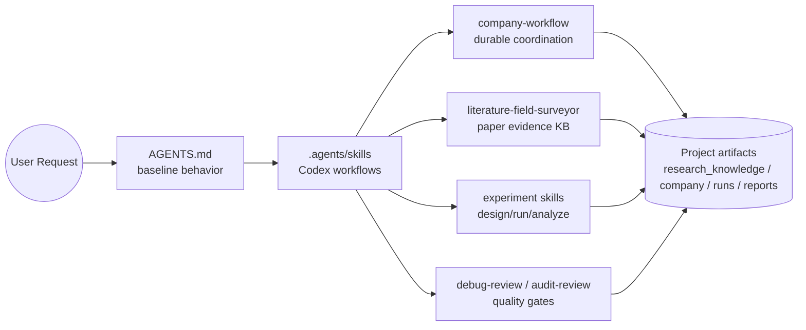
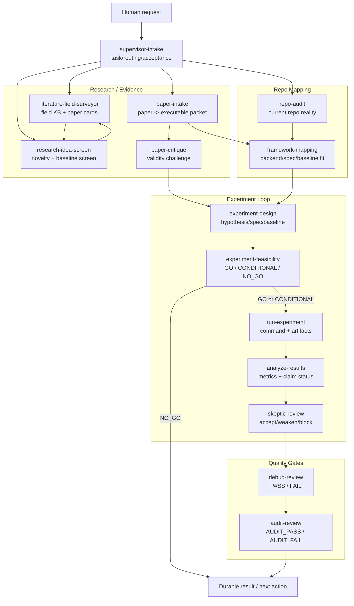
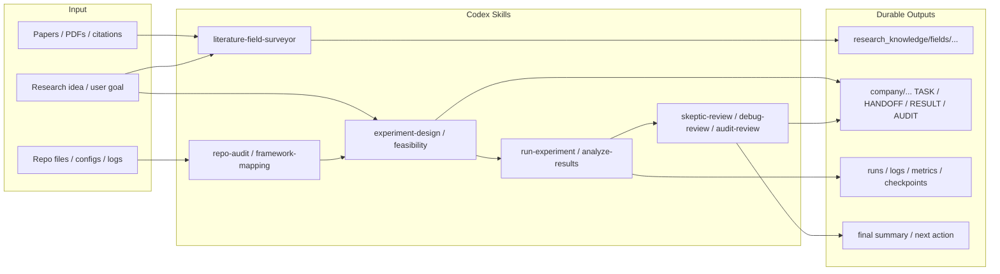
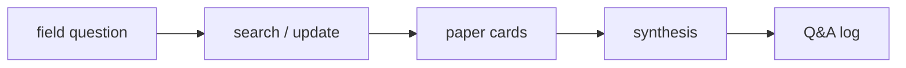
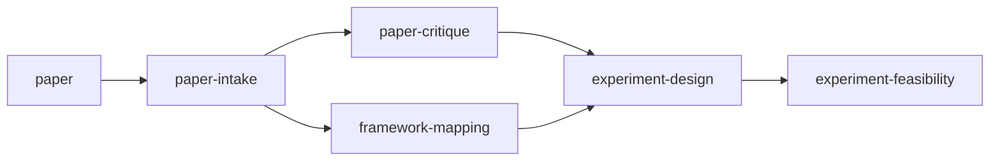
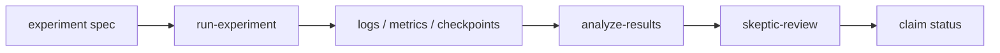
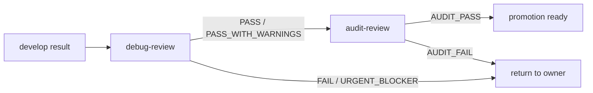
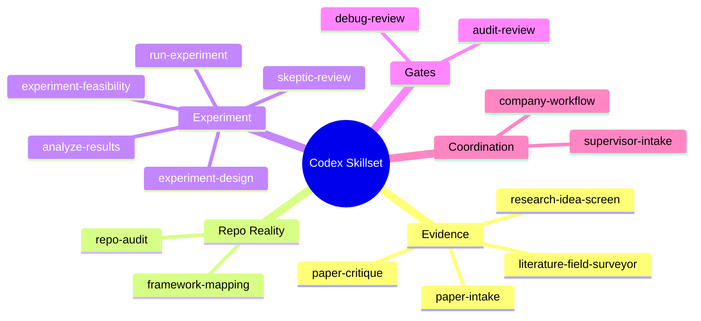

# Codex Skillset

Codex에서 연구, 논문 조사, 실험 설계, 실행 검증, 감사까지 일관되게 처리하기 위한 project-local skill harness.

이 저장소는 **Codex-native skills**를 관리한다. Claude Code의 `agents/*.md` 방식이나 OMX의 `omx team` runtime과 다르다. 기본 운영 단위는 `.agents/skills/*/SKILL.md`이며, 장기 상태가 필요한 작업은 Markdown artifact로 남긴다.

## Source Of Truth

- `AGENTS.md`: 모든 프로젝트에 적용할 기본 행동 규칙
- `.agents/skills/*/SKILL.md`: Codex가 직접 사용하는 작업별 workflow
- `.agents/skills/company-workflow/references/workflow.md`: company-style durable workflow의 공통 정책과 문서 형식
- `.agents/skills/literature-field-surveyor/`: paper-grounded literature survey, paper card, synthesis, Q&A workflow

이 저장소는 OMX 상태를 포함하지 않는다. `.omx/`, `.codex/agents/*.toml`, tmux worker, `omx team`은 기본 경로가 아니다.

## 전체 구조



## 운영 원칙

- Codex는 이 repo에서 **skills 중심**으로 동작한다고 생각한다.
- `company-workflow`는 agent team runtime이 아니라 파일 기반 운영 규칙이다.
- `literature-field-surveyor`는 field survey, paper card, synthesis, Q&A의 source of truth다.
- 실험 설계와 실행은 literature card만으로 끝내지 않고 repo mapping, feasibility, result analysis, skeptical review로 이어간다.
- Debug와 Audit은 분리한다. 구현자가 스스로 최종 품질을 인증하지 않는다.
- 실험이 실행됐다는 사실과 과학적 결론이 확인됐다는 사실을 분리한다.
- OMX는 명시적으로 요청받을 때만 사용한다.

## Core Workflow



## 산출물 관점



## Skill Catalog

| Skill | 역할 | 대표 입력 | 대표 출력 |
|---|---|---|---|
| `company-workflow` | company-style durable workflow 공통 규칙 | 장기 task, handoff, gate가 필요한 작업 | routing, artifact policy, closure rules |
| `supervisor-intake` | 요청을 task와 next owner로 정규화 | 새 사용자 요청, 재라우팅 요청 | `TASK`, acceptance criteria, `HANDOFF` |
| `literature-field-surveyor` | 논문 조사, paper card, synthesis, Q&A | 분야 조사, SOTA, 비교 논문, 논문 설명 | `research_knowledge/fields/...` |
| `research-idea-screen` | 아이디어 novelty, repo overlap, baseline screen | 새 연구 아이디어, hypothesis | `IDEA`, 비교 논문, 최소 실험 방향 |
| `paper-intake` | 논문을 executable research packet으로 변환 | paper, citation, PDF, note set | executable claims, dataset/model/eval packet |
| `paper-critique` | 논문 claim의 약점과 위험 비판 | paper claim, reproduction plan | missing baselines, leakage risk, blocked claims |
| `repo-audit` | repo 현실 파악 | architecture/refactor/experiment 전 사전 조사 | entrypoint/config/engine/metric map |
| `framework-mapping` | idea/paper를 현재 backend에 매핑 | paper packet, model change, dataset idea | backend fit, copied variant recommendation |
| `experiment-design` | 실행 가능한 실험 설계 | paper packet, idea, repo mapping | hypothesis, baseline, variant, metric, artifact plan |
| `experiment-feasibility` | 실험 가능성 판정 | experiment proposal/spec | `GO`, `CONDITIONAL`, `NO_GO` |
| `run-experiment` | 준비된 실험 실행 | canonical spec or command | command, logs, checkpoints, metrics, status |
| `analyze-results` | 실험 결과 해석 | metrics, logs, predictions, run summaries | baseline comparison, claim status |
| `skeptic-review` | 결론 수용 전 skeptical pass | result analysis, paper reproduction claim | accept/weaken/defer/block decision |
| `debug-review` | audit 전 blocking debug gate | implementation output, logs, changed files | `PASS`, `PASS_WITH_WARNINGS`, `FAIL`, `URGENT_BLOCKER` |
| `audit-review` | 최종 독립 감사 | pushed branch/result/debug evidence | `AUDIT_PASS`, `AUDIT_PASS_WITH_CAVEATS`, `AUDIT_FAIL` |

## 활용 갈래

### A. 분야 조사 / 논문 카드

```text
User: full-band 48 kHz speech enhancement 논문 조사하고 card로 정리해줘.
Skill: literature-field-surveyor
Output: research_knowledge/fields/<field>/papers, synthesis, qna
```

흐름:



### B. 논문을 실험으로 변환

```text
User: 이 논문을 우리 repo에서 재현 가능한 실험 packet으로 바꿔줘.
Skills: paper-intake -> paper-critique -> framework-mapping -> experiment-design
```

흐름:



### C. 연구 아이디어 screening

```text
User: high-band refinement 방향이 novelty 있는지 비교논문과 함께 평가해줘.
Skills: research-idea-screen + literature-field-surveyor + framework-mapping
```

출력은 보통 다음을 포함한다.

- idea를 falsifiable hypothesis로 재정의
- 기존 paper / baseline / repo overlap
- 가장 위험한 비교 논문
- 최소 credible experiment
- proceed / refine / defer / drop 결정

### D. Repo 기반 구현 또는 실험 설계 전 조사

```text
User: TF-Restormer 구조를 차용해서 lightweight 48 kHz SE 모델을 만들 수 있을지 repo 기준으로 봐줘.
Skills: repo-audit -> framework-mapping -> experiment-design -> experiment-feasibility
```

### E. 실험 실행과 결과 해석

```text
User: 이 spec으로 smoke run 실행하고 결과를 분석해줘.
Skills: run-experiment -> analyze-results -> skeptic-review
```

흐름:



### F. 검증 / 감사

```text
User: 이 변경이 merge 가능한지 검증해줘.
Skills: debug-review -> audit-review
```

`debug-review`는 실제 동작 검증에 가깝고, `audit-review`는 최종 독립 감사다.



## Direct Skill Usage

Codex에게 명시적으로 skill을 지시할 수 있다.

```text
Use literature-field-surveyor to survey low-hallucination full-band SE.
Use research-idea-screen to evaluate this high-band refinement idea.
Use framework-mapping to map this proposal onto the current repo.
Use experiment-feasibility to decide GO / NO_GO before implementation.
Use debug-review to verify this change before audit.
```

한국어로도 동일하게 말하면 된다.

```text
literature-field-surveyor 스킬로 이 분야 조사해줘.
research-idea-screen 기준으로 이 아이디어 novelty 평가해줘.
framework-mapping으로 현재 repo에 어떻게 들어갈지 봐줘.
```

## 새 프로젝트에 적용

가장 단순한 방식은 복사다.

```bash
cd /home/wooseok/project
git clone git@github.com:woosook0127/Codex_Skillset.git
rsync -a Codex_Skillset/.agents/ /path/to/new_project/.agents/
cp Codex_Skillset/AGENTS.md /path/to/new_project/AGENTS.md
```

확인:

```bash
cd /path/to/new_project
find .agents/skills -maxdepth 2 -name SKILL.md | sort
```

복사 방식은 프로젝트별 커스터마이징이 쉽다. 중앙 업데이트를 즉시 반영하고 싶으면 symlink나 submodule을 쓸 수 있지만, 연구 프로젝트에서는 복사 후 필요한 부분만 조정하는 방식을 우선 권장한다.

## Skillset 업데이트

프로젝트에서 skill을 수정한 뒤 이 repo에 반영하려면:

```bash
cd /home/wooseok/project/Codex_Skillset
./scripts/sync_from_project.sh /path/to/project
git add .agents AGENTS.md README.md scripts
git commit -m "Update Codex skillset"
git push
```

검증:

```bash
find .agents/skills -maxdepth 2 -name SKILL.md | sort
find .agents -type l -print
```

Broken symlink가 있으면 push하지 않는다.

## Claude Setting과의 차이

이 저장소는 `https://github.com/dmlguq456/claude_setting`의 workflow-map 스타일을 참고했지만, 실행 모델은 다르다.

| 항목 | Claude Setting | Codex Skillset |
|---|---|---|
| 실행 단위 | Claude slash skills + Claude agents | Codex project-local skills |
| Agent 정의 | `agents/*.md`가 callable agent처럼 동작 | custom native agent registry를 전제하지 않음 |
| 협업 방식 | Claude agent orchestration | Codex main agent + skills + durable artifacts |
| 장기 상태 | `.claude_reports/` | `research_knowledge/`, `company/`, runs/logs |
| OMX 사용 | 해당 없음 | 기본 비사용, 명시 요청 시만 |
| 강점 | 자동 pipeline과 agent role 분리 | Codex에서 덜 헷갈리는 skill 중심 운영 |

## Non-Goals

- OMX team runtime을 대체하지 않는다.
- `.codex/agents/*.toml` agent registry를 관리하지 않는다.
- 모든 프로젝트에 동일한 company state tree를 강제로 만들지 않는다.
- 실험 결과를 자동으로 과학적 결론으로 승격하지 않는다.
- paper card 형식을 불필요하게 바꾸지 않는다.

## 현재 Core Skill Set


